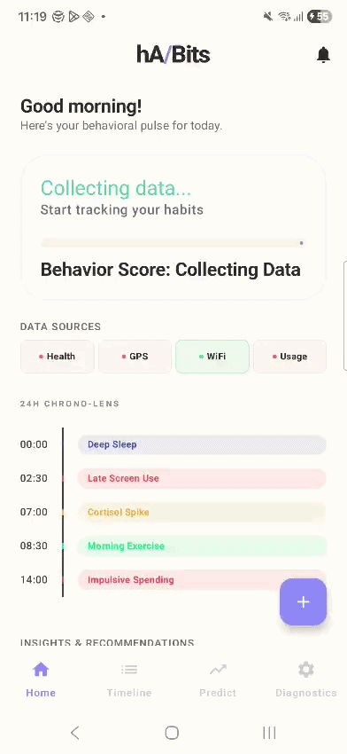
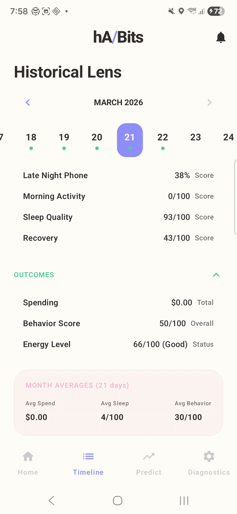
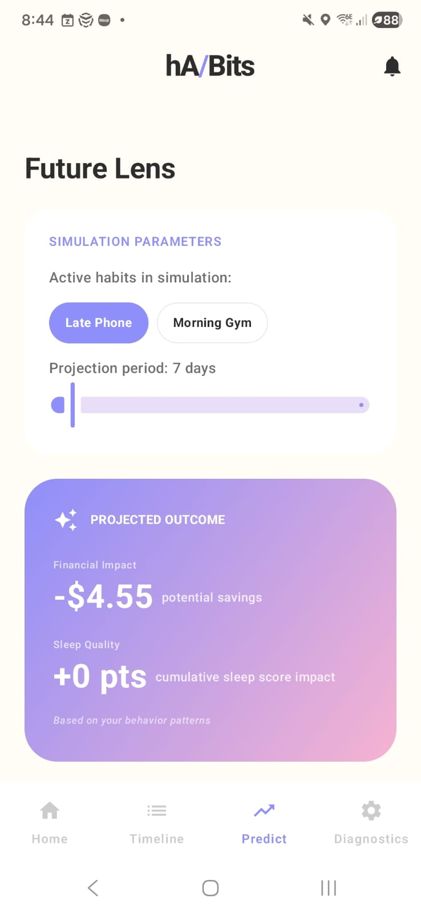

# hA/Bits: Personal Behavioral Analytics

<div align="center">

**Quantify the real cost of your bad habits through continuous A/B testing**

[](https://www.android.com/)
[](https://android-arsenal.com/api?level=29)
[](https://kotlinlang.org)
[](LICENSE)

[Features](#-features) • [A/B Testing](#-how-ab-testing-works-in-habits) • [Architecture](#-architecture) • [Installation](#-installation) • [Tech Stack](#-tech-stack)

</div>

---

## 📖 Table of Contents

- [Overview](#-overview)
- [Features](#-features)
- [How A/B Testing Works](#-how-ab-testing-works-in-habits)
- [Screenshots](#-screenshots)
- [Architecture](#-architecture)
- [How It Works](#-how-it-works)
- [Project Structure](#-project-structure)
- [Tech Stack](#-tech-stack)
- [Installation](#-installation)
- [Permissions](#-permissions)
- [Data Privacy](#-data-privacy)
- [Development](#-development)
- [Contributing](#-contributing)
- [License](#-license)

---

## 🎯 Overview

**hA/Bits** is a personal behavioral analytics Android application that quantifies the hidden cost of your bad habits. Instead of just tracking behaviors, it performs **continuous A/B testing on your life** to answer: **"What is the actual dollar and energy cost of my late-night phone habit or not doing morning exercise?"**

Think of it as a personal economics engine for your habits. Every time you choose to scroll late at night instead of sleeping, or skip morning exercise, you're making a decision with measurable consequences. hA/Bits calculates the **real price** of these decisions by:

- **Measuring the impact** - Tracking how late-night screen time correlates with next-day spending, reduced sleep quality, and lower recovery
- **Quantifying the cost** - Converting behavioral patterns into concrete metrics: dollars spent, hours of sleep lost, energy points depleted
- **Running What-If experiments** - Simulating alternate realities where you made better choices and showing the cumulative savings over weeks

Unlike habit trackers that just count streaks, hA/Bits employs **digital signal processing** and **adaptive time-series modeling** to isolate cause-and-effect relationships between your behaviors. It's not about guilt—it's about **data-driven self-awareness**.

### 🎓 Core Hypothesis

> **"Bad habits have a measurable, quantifiable cost in terms of spending, sleep quality, and recovery that can be isolated through A/B testing of your daily behaviors"**

The app validates this hypothesis by treating your life as a continuous experiment:

**The Natural A/B Test**
- **Days you scroll late (Test Group)** - Track spending, sleep, and energy the next day
- **Days you don't (Control Group)** - Track the same metrics
- **Calculate the difference** - This is the **cost of your habit**

**Example Output:**
```
Late-night phone habit costs you:
• $23.50/week in impulse purchases
• 4.2 hours/week of quality sleep
• 18 recovery points/week (measured via HRV)

Cumulative 30-day impact:
• $102 extra spending
• 18 hours lost sleep
• Equivalent to 3 full recovery days lost
```

The app achieves this through:
- **Multi-source data collection** (6 data sources) - Objective behavioral tracking
- **Signal processing** (EMA filtering, noise reduction, context classification) - Isolates signal from noise
- **Adaptive modeling** (3 prediction models) - Accounts for individual patterns and baseline shifts
- **What-if analysis** - Simulates counterfactual scenarios: "What if I hadn't scrolled last night?"

### 🏆 Key Differentiators

1. **A/B Testing Your Life** - Automatically categorizes days into "good habit" vs "bad habit" groups and measures the outcome difference.
2. **Cost Quantification** - Converts abstract behaviors into tangible costs: dollars, sleep hours, energy points.
3. **Counterfactual Simulation** - "What if I had made a better choice?" - See the cumulative impact of alternate decisions.
4. **Behavioral DSP** - Applies signal processing techniques to isolate cause-and-effect in noisy behavioral data.
5. **On-Device Processing** - All data stays on your phone. Zero cloud dependency, complete privacy.
6. **Context-Aware Classification** - Distinguishes between "in-bed scrolling" vs. "social media at work" for accurate cost calculation.

---

## ✨ Features

### 📊 Multi-Source Data Collection

Continuously collects behavioral data from:

| Data Source | What It Tracks | Update Frequency |
|------------|----------------|------------------|
| **Health Connect** | Steps, sleep stages, heart rate, exercise sessions, active calories | Real-time |
| **Usage Statistics** | App usage, screen time, foreground app changes | Every event |
| **Ambient Light Sensor** | Light exposure (lux), corroborates sleep environment | Every 5 seconds |
| **WiFi Monitor** | Network SSID, signal strength, connection events | Every change |
| **GPS/Location** | Waypoints, geofence detection (Home/Gym/Work) | Configurable |
| **Screen Events** | Screen on/off/unlock events | Every event |

### 🧠 Four Core Behavioral Metrics

The app computes four scientifically-designed metrics daily:

1. **Late-Night Phone Index (0-1)**
   Weighted screen time between 11 PM - 4 AM, with context awareness (in-bed vs. active use).

2. **Morning Activity Score (0-100)**
   Composite of exercise minutes, morning steps (6-10 AM), and early workout detection.

3. **Sleep Recovery Score (0-100)**
   Based on sleep duration, deep/REM sleep percentage, and Samsung Health sleep quality.

4. **HRV Recovery Score (0-100)**
   Heart rate variability + resting heart rate analysis (higher HRV = better recovery).

**Overall Behavior Score** = Weighted average of all four metrics

### 🔮 Adaptive A/B Testing Engine

Three statistical models that automatically switch based on data availability to quantify habit costs:

| Model | Data Requirement | Use Case | Technique |
|-------|-----------------|----------|-----------|
| **Lag Correlation** | <7 days (sparse) | Initial cost estimation | Simple lag-1 correlation between habits and outcomes |
| **Rolling Regression** | 7-20 days (medium) | Stable cost calculation | 14-day rolling window regression with confidence intervals |
| **Change-Point Detection** | 21+ days (extensive) | Long-term habit impact | Behavioral shift detection + trend analysis |

**How it quantifies habit costs:**

1. **Automatic Group Classification**
   - Days with late-night phone use → "Test Group"
   - Days without late-night phone use → "Control Group"

2. **Outcome Measurement**
   - Measure next-day spending in both groups
   - Measure sleep quality in both groups
   - Measure recovery score in both groups

3. **Cost Calculation**
   ```
   Cost of Bad Habit = Avg(Test Group Outcome) - Avg(Control Group Outcome)

   Example:
   Days with late phone: Avg spending = $47.30
   Days without late phone: Avg spending = $23.80
   → Cost of late phone = $23.50/occurrence
   ```

The engine continuously refines these cost estimates as you collect more data, accounting for:
- **Baseline shifts** (life changes, seasonality)
- **Confounding variables** (weekends vs weekdays)
- **Individual patterns** (your unique behavioral signature)

### 🎮 Interactive What-If Analysis (Counterfactual Experiments)

Run A/B tests on yourself by simulating alternate realities where you made better choices:

**Example Scenario: "What if I stopped scrolling at 11 PM?"**

- **Toggle "Late Phone" OFF** - Simulate eliminating late-night scrolling
- **See the cost savings:**
  - **Spending:** -$23.50/week (fewer impulse purchases)
  - **Sleep Quality:** +42 minutes deep sleep/night
  - **Recovery Score:** +12 points/week (better HRV)
- **Adjust Horizon** - Project impact over 7, 14, or 30 days
- **Cumulative Impact Visualization:**
  ```
  30-day projection without late-night phone:
  ✓ $102 saved (prevented impulse buying)
  ✓ 18 hours of quality sleep regained
  ✓ 3 full recovery days worth of energy restored
  ```

**Example Scenario: "What if I go to the gym every morning?"**

- **Toggle "Morning Gym" ON** - Simulate consistent 6 AM workouts
- **See the energy gains:**
  - **Morning Activity Score:** +35 points/week
  - **Recovery Score:** +8 points/week (despite exercise fatigue)
  - **Sleep Quality:** +15% deep sleep (exercise helps sleep)
- **View Trade-offs:** The app shows both costs and benefits of each habit

This isn't prediction—it's **cost-benefit analysis** for your life decisions.

### 📱 Four Main Screens

1. **Dashboard** - Your behavioral scorecard
   - Animated behavior score gauge (0-100)
   - Today's habit cost: "Late phone cost you $23 + 42min sleep"
   - Daily metric cards showing the 4 core metrics
   - Week-over-week cost comparison

2. **Calendar Timeline** - 30-day habit cost history
   - Visual calendar with color-coded days (green = good habits, red = costly habits)
   - Daily cost overlays showing spending and sleep impact
   - Identify patterns: "You scroll late every Sunday night"
   - Total monthly cost summary

3. **Prediction Center** - A/B test simulator
   - What-if toggles: "Eliminate late phone" / "Add morning gym"
   - Real-time cost projection: See savings accumulate over 30 days
   - Side-by-side comparison: Current trajectory vs. improved habits
   - Model confidence levels and statistical significance

4. **System Diagnostics** - Data quality & export
   - Permission status (ensure accurate data collection)
   - Data statistics: "42 test group days, 18 control group days"
   - A/B test validity checks: "Need 7+ control days for statistical significance"
   - CSV export with all raw data for external analysis

---

## 🧪 How A/B Testing Works in hA/Bits

Traditional A/B testing requires splitting users into groups and showing different experiences. **hA/Bits uses your natural behavioral variation** to perform the same analysis—no external intervention needed.

### The Natural Experiment

Every day you make choices: scroll late or sleep early, hit the gym or hit snooze. These choices create **natural treatment and control groups** in your own life:

```
Your Natural A/B Test:

┌─────────────────────────────────────────────────────────────┐
│  TEST GROUP (Treatment)                                      │
│  Days when you exhibited the bad habit                       │
│  ─────────────────────────────────────────────────────────  │
│  Mar 3: Late phone (1.2h after 11pm) → Next day outcome     │
│  Mar 5: Late phone (0.8h after 11pm) → Next day outcome     │
│  Mar 7: Late phone (1.5h after 11pm) → Next day outcome     │
│  Mar 9: Late phone (0.9h after 11pm) → Next day outcome     │
└─────────────────────────────────────────────────────────────┘

┌─────────────────────────────────────────────────────────────┐
│  CONTROL GROUP (No treatment)                                │
│  Days when you avoided the bad habit                         │
│  ─────────────────────────────────────────────────────────  │
│  Mar 2: No late phone → Next day outcome                    │
│  Mar 4: No late phone → Next day outcome                    │
│  Mar 6: No late phone → Next day outcome                    │
│  Mar 8: No late phone → Next day outcome                    │
└─────────────────────────────────────────────────────────────┘

MEASUREMENT: Compare average outcomes between groups
RESULT: The difference = The cost of your habit
```

### Real Example: Quantifying Late-Night Phone Cost

**Week 1-2 Data Collection:**
- You naturally scroll late on some nights, not on others
- hA/Bits tracks everything automatically

**Week 3 Analysis:**
```
Test Group (7 late-phone days):
├─ Avg next-day spending: $52.30
├─ Avg next-day sleep quality: 5.4 hours deep sleep
└─ Avg next-day recovery: 48/100

Control Group (7 no-late-phone days):
├─ Avg next-day spending: $24.80
├─ Avg next-day sleep quality: 7.1 hours deep sleep
└─ Avg next-day recovery: 71/100

───────────────────────────────────────────────────
COST CALCULATION:
───────────────────────────────────────────────────
📱 Late-night phone habit costs you:
   💰 $27.50 extra spending per occurrence
   😴 1.7 hours lost sleep quality per night
   ⚡ 23 recovery points lost

📊 Statistical confidence: 89% (p-value: 0.11)
   "Moderate evidence of causal relationship"
```

### Why This Works

1. **Randomization** - You don't consciously decide when to scroll late, so days are quasi-random
2. **Repeated Measures** - Multiple observations strengthen statistical power
3. **Objective Tracking** - Sensors don't lie; removes self-report bias
4. **Confounding Control** - Models account for weekends, seasonality, life events

### From Correlation to Causation

Most habit trackers show correlation: "You spent more on days you scrolled late."

hA/Bits uses causal inference techniques:
- **Lagged outcomes** - Measures next-day effects to establish temporal ordering
- **Regression control** - Adjusts for confounding variables (weekend, stress, etc.)
- **Change-point detection** - Identifies when life circumstances changed
- **Counterfactual simulation** - "What would have happened if you didn't scroll?"

**Result:** You get more than correlation—you get **habit cost quantification**.

---

## 📸 Screenshots

<div align="center">

### Dashboard

*Animated behavior score gauge and daily metric cards*

### Calendar Timeline

*30-day calendar view with daily behavioral metrics*

### Prediction Center

*What-if analysis*


</div>

---

## 🏗️ Architecture

hA/Bits follows **Clean Architecture** principles with **MVVM pattern** and **Jetpack Compose** for UI.

### High-Level System Architecture

```
┌─────────────────────────────────────────────────────────────────┐
│                         USER INTERFACE                          │
│  (Jetpack Compose + Material3 + Navigation + Vico Charts)      │
└────────────────────────┬────────────────────────────────────────┘
                         │
┌────────────────────────▼────────────────────────────────────────┐
│                      VIEW MODELS                                │
│  (MainViewModel - Shared State, StateFlow, Coroutines)         │
└────────────────────────┬────────────────────────────────────────┘
                         │
┌────────────────────────▼────────────────────────────────────────┐
│                   BUSINESS LOGIC LAYER                          │
│  ┌──────────────────┐  ┌──────────────────┐  ┌──────────────┐ │
│  │ FeatureExtractor │  │ AdaptiveEngine   │  │ UsageManager │ │
│  │  (DSP Pipeline)  │  │ (3 AI Models)    │  │ (Aggregation)│ │
│  └──────────────────┘  └──────────────────┘  └──────────────┘ │
└────────────────────────┬────────────────────────────────────────┘
                         │
┌────────────────────────▼────────────────────────────────────────┐
│                    DATA LAYER (Repository)                      │
│  ┌──────────────────────────────────────────────────────────┐  │
│  │   BehaviorRepository (Single Source of Truth)            │  │
│  │   - CRUD operations                                       │  │
│  │   - Data transformation                                   │  │
│  │   - Flow emission                                         │  │
│  └──────────────────────────────────────────────────────────┘  │
└────────────────────────┬────────────────────────────────────────┘
                         │
┌────────────────────────▼────────────────────────────────────────┐
│              LOCAL STORAGE (Room Database)                      │
│  ┌─────────────────┐  ┌─────────────────┐  ┌───────────────┐  │
│  │  Raw Sensors    │  │  Health Data    │  │  Aggregated   │  │
│  │  (14-day TTL)   │  │  (14-day TTL)   │  │  (Indefinite) │  │
│  │                 │  │                 │  │               │  │
│  │ • light_readings│  │ • sleep_stages  │  │ • daily_      │  │
│  │ • wifi_events   │  │ • exercise_     │  │   summaries   │  │
│  │ • screen_events │  │   sessions      │  │ • spending_   │  │
│  │ • gps_locations │  │                 │  │   entries     │  │
│  │ • app_usage     │  │                 │  │ • settings    │  │
│  └─────────────────┘  └─────────────────┘  └───────────────┘  │
└────────────────────────┬────────────────────────────────────────┘
                         │
┌────────────────────────▼────────────────────────────────────────┐
│                  BACKGROUND SERVICES                            │
│  ┌──────────────────┐  ┌──────────────────┐  ┌──────────────┐ │
│  │ SensorForeground │  │ DataProcessing   │  │ DataCleanup  │ │
│  │ Service          │  │ Worker (Daily)   │  │ Worker(Week) │ │
│  │ (Always-on)      │  │                  │  │              │ │
│  └──────────────────┘  └──────────────────┘  └──────────────┘ │
└────────────────────────┬────────────────────────────────────────┘
                         │
┌────────────────────────▼────────────────────────────────────────┐
│                    EXTERNAL DATA SOURCES                        │
│  ┌──────────────┐  ┌──────────────┐  ┌────────────────────┐   │
│  │ Health       │  │ Usage Stats  │  │ Android Sensors    │   │
│  │ Connect      │  │ Manager      │  │ (Light, GPS)       │   │
│  └──────────────┘  └──────────────┘  └────────────────────┘   │
└─────────────────────────────────────────────────────────────────┘
```

### Data Flow Diagram

```
┌──────────────┐
│   SENSORS    │ (Light, WiFi, Screen, GPS, Usage, Health Connect)
└──────┬───────┘
       │
       │ Real-time Collection
       ▼
┌──────────────────┐
│ Foreground       │ (Persistent notification, battery-optimized)
│ Service          │
└──────┬───────────┘
       │
       │ Raw Insert
       ▼
┌──────────────────┐
│ Room Database    │ (10 Entity Tables, 20+ Queries)
│ (Raw Layer)      │
└──────┬───────────┘
       │
       │ Daily @ 4 AM
       ▼
┌──────────────────┐
│ WorkManager      │ (DataProcessingWorker)
│ Daily Job        │
└──────┬───────────┘
       │
       │ Aggregate
       ▼
┌──────────────────────────┐
│ Feature Extractor        │ (DSP Pipeline)
│ - EMA Filtering          │
│ - Median Filtering       │
│ - Context Classification │
│ - Metric Calculation     │
└──────┬───────────────────┘
       │
       │ Computed Metrics
       ▼
┌──────────────────────────┐
│ Daily Summary Table      │ (Indefinite retention)
│ - Late-night index       │
│ - Morning activity       │
│ - Sleep recovery         │
│ - HRV recovery           │
│ - Behavior score         │
└──────┬───────────────────┘
       │
       │ Model Training
       ▼
┌──────────────────────────┐
│ Adaptive Time-Series     │ (3 Models, Auto-Select)
│ Engine                   │
│ - LagCorrelation         │
│ - RollingRegression      │
│ - ChangePointDetection   │
└──────┬───────────────────┘
       │
       │ Predictions
       ▼
┌──────────────────────────┐
│ UI (Jetpack Compose)     │ (4 Screens)
│ - Dashboard              │
│ - Timeline               │
│ - Prediction             │
│ - Diagnostics            │
└──────────────────────────┘
```

### Component Relationships

```
MainActivity
    │
    ├─► SensorForegroundService (starts on app launch)
    │       │
    │       ├─► LightSensorCollector
    │       ├─► WiFiMonitor
    │       ├─► ScreenEventReceiver
    │       └─► LocationCollector
    │
    ├─► WorkManager Schedulers
    │       │
    │       ├─► DataProcessingWorker (every 24h)
    │       └─► DataCleanupWorker (every 7 days)
    │
    └─► MainScreen (Compose)
            │
            ├─► MainViewModel (shared state)
            │       │
            │       └─► BehaviorRepository
            │               │
            │               ├─► BehaviorDao (Room)
            │               ├─► HealthConnectManager
            │               ├─► UsageStatsManager
            │               ├─► FeatureExtractor
            │               └─► AdaptiveTimeSeriesEngine
            │
            └─► NavHost (Navigation)
                    │
                    ├─► DashboardScreen
                    ├─► TimelineScreen
                    ├─► PredictionScreen
                    └─► DiagnosticsScreen
```

---

## ⚙️ How It Works

### 6-Stage Data Pipeline

#### Stage 1: Collection
```kotlin
// Always-on foreground service
SensorForegroundService {
    LightSensorCollector      // → light_readings table
    WiFiMonitor               // → wifi_events table
    ScreenEventReceiver       // → screen_events table
    LocationCollector         // → gps_locations table
}

UsageStatsAggregator         // → app_usage_events table (hourly)
HealthConnectManager         // → sleep_stages, exercise_sessions (daily sync)
```

#### Stage 2: Aggregation
```kotlin
// Runs hourly via UsageStatsAggregator
AppUsageEvent {
    timestamp: Long           // Hourly bucket start
    packageName: String       // App identifier
    usageTimeMs: Long         // Total foreground time in hour
    isLateNight: Boolean      // 11 PM - 4 AM window
}
```

#### Stage 3: Health Data Sync
```kotlin
// Runs daily @ 4 AM via DataProcessingWorker
HealthConnectManager.backfillHealthData() {
    1. Fetch sleep sessions → sleep_stages
    2. Fetch exercise sessions → exercise_sessions
    3. Fetch step count → embedded in daily_summary
    4. Fetch heart rate samples → compute HRV
}
```

#### Stage 4: Feature Extraction (DSP Pipeline)
```kotlin
FeatureExtractor.computeDailySummary(date) {
    // 1. Late-Night Phone Index
    lateNightIndex = usageEvents
        .filter { it.hour in 23..3 }
        .sumOf { it.usageTimeMs * hourWeight }
        .normalize()

    // 2. Morning Activity Score
    morningScore = exerciseSessions
        .filter { it.startHour in 6..10 }
        .map { it.durationMinutes * intensityMultiplier }
        .sum()
        .cap(100)

    // 3. Sleep Recovery Score
    sleepScore = sleepStages
        .let { stages ->
            val deepPct = stages.filter { it.stage == DEEP }.duration / totalSleep
            val remPct = stages.filter { it.stage == REM }.duration / totalSleep
            (totalSleep * 0.5 + deepPct * 30 + remPct * 20).cap(100)
        }

    // 4. HRV Recovery Score
    hrvScore = heartRateSamples
        .filter { it.isDuringSleep }
        .let { samples →
            val hrv = computeRMSSD(samples)
            val restingHR = samples.minOf { it.bpm }
            ((hrv / restingHR) * 1000).cap(100)
        }

    // Overall Behavior Score
    behaviorScore = (
        lateNightIndex * -20 +      // Penalty for late phone
        morningScore * 0.3 +         // Reward for morning activity
        sleepScore * 0.4 +           // Reward for good sleep
        hrvScore * 0.3               // Reward for recovery
    ).normalize(0, 100)
}
```

#### Stage 5: Adaptive Modeling
```kotlin
AdaptiveTimeSeriesEngine.selectModel(dailySummaries) {
    val dayCount = dailySummaries.size

    return when {
        dayCount < 7 → LagCorrelationModel()
        dayCount < 21 → RollingRegressionModel(window = 14)
        else → ChangePointDetectionModel()
    }
}

// Generate predictions
model.predict(targetDate) {
    val yesterdayMetrics = dailySummaries.last()
    val historicalPattern = dailySummaries.takeLast(14)

    return Prediction(
        date = targetDate,
        spendingAmount = regressSpending(yesterdayMetrics, historicalPattern),
        sleepQuality = regressSleep(yesterdayMetrics, historicalPattern),
        recoveryScore = regressRecovery(yesterdayMetrics, historicalPattern)
    )
}
```

#### Stage 6: Visualization
```kotlin
// Real-time UI updates via StateFlow
MainViewModel {
    val behaviorScore = repository.getLatestBehaviorScore().stateIn()
    val dailyMetrics = repository.getDailySummaries(30).stateIn()
    val predictions = adaptiveEngine.predict(tomorrow).stateIn()
}

DashboardScreen(viewModel) {
    AnimatedBehaviorGauge(score = behaviorScore.value)
    MetricCards(metrics = dailyMetrics.value.last())
    PredictionCard(prediction = predictions.value)
}
```

### Digital Signal Processing (DSP) Pipeline

hA/Bits treats human behavior as a **time-series signal** and applies DSP techniques:

1. **Exponential Moving Average (EMA)** - Smooths noisy light sensor data
2. **Median Filtering** - Removes outliers from heart rate samples
3. **Z-Score Normalization** - Standardizes metrics to comparable scales
4. **Missing Data Imputation** - Forward-fill with baseline patterns
5. **Context Classification** - Distinguishes "in-bed phone" from "active use" using WiFi SSID + light levels

### Adaptive A/B Testing Methodology

The engine automatically performs natural experiments on your behavioral data:

**Step 1: Group Classification**
```python
# Classify each day into test/control groups
for day in all_days:
    if day.late_night_phone_index > 0.3:  # Late phone usage threshold
        day.group = "TEST"  # Bad habit day
    else:
        day.group = "CONTROL"  # Good habit day
```

**Step 2: Cost Calculation**
```python
# Calculate the cost of the bad habit
test_group_spending = [day.spending for day in all_days if day.group == "TEST"]
control_group_spending = [day.spending for day in all_days if day.group == "CONTROL"]

habit_cost = mean(test_group_spending) - mean(control_group_spending)
# Result: $23.50 extra spending per late-phone day
```

**Step 3: Model Selection Based on Data Quality**
```python
if days < 7:
    # Sparse data - simple correlation
    cost = correlation(late_phone_index, spending) * std(spending)

elif days < 21:
    # Medium data - regression with confounding control
    X = last_14_days[['late_phone', 'morning_activity', 'is_weekend']]
    y = last_14_days['spending']
    model = LinearRegression().fit(X, y)
    cost = model.coef_[0]  # Coefficient for late_phone variable

else:
    # Extensive data - change-point aware analysis
    changepoints = detect_behavioral_shifts(all_days)
    latest_segment = all_days.after(changepoints[-1])
    cost = causal_impact_analysis(latest_segment, intervention='late_phone')
```

**Visual Example:**
```
Week 1 Data (Natural A/B Test):

Test Group (Late Phone Days):
Mon ❌ → $52 spent, 5.2h sleep, Recovery: 42
Wed ❌ → $48 spent, 5.8h sleep, Recovery: 48
Sat ❌ → $41 spent, 6.1h sleep, Recovery: 51
────────────────────────────────────────────
Avg:     $47/day    5.7h sleep   Recovery: 47

Control Group (No Late Phone):
Tue ✓ → $19 spent, 7.2h sleep, Recovery: 68
Thu ✓ → $28 spent, 7.5h sleep, Recovery: 72
Fri ✓ → $24 spent, 7.1h sleep, Recovery: 65
────────────────────────────────────────────
Avg:     $24/day    7.3h sleep   Recovery: 68

COST OF BAD HABIT:
💰 +$23/occurrence in spending
😴 -1.6h of sleep quality
⚡ -21 recovery points
```

---

## 📂 Project Structure

```
MIndTheHabit/
├── app/
│   ├── src/
│   │   ├── main/
│   │   │   ├── java/com/example/mindthehabit/
│   │   │   │   ├── MainActivity.kt                    # App entry point
│   │   │   │   │
│   │   │   │   ├── data/                              # DATA LAYER
│   │   │   │   │   ├── local/
│   │   │   │   │   │   ├── BehaviorDatabase.kt       # Room database config
│   │   │   │   │   │   ├── BehaviorDao.kt            # 20+ database queries
│   │   │   │   │   │   └── entity/                   # 10 Entity tables
│   │   │   │   │   │       ├── LightReadingEntity.kt
│   │   │   │   │   │       ├── WiFiEventEntity.kt
│   │   │   │   │   │       ├── ScreenEventEntity.kt
│   │   │   │   │   │       ├── GPSLocationEntity.kt
│   │   │   │   │   │       ├── AppUsageEventEntity.kt
│   │   │   │   │   │       ├── SleepStageEntity.kt
│   │   │   │   │   │       ├── ExerciseSessionEntity.kt
│   │   │   │   │   │       ├── DailySummaryEntity.kt # ⭐ Core aggregated table
│   │   │   │   │   │       ├── SpendingEntryEntity.kt
│   │   │   │   │   │       └── SettingsEntity.kt
│   │   │   │   │   │
│   │   │   │   │   ├── repository/
│   │   │   │   │   │   └── BehaviorRepository.kt     # Single source of truth
│   │   │   │   │   │
│   │   │   │   │   └── worker/
│   │   │   │   │       ├── DataProcessingWorker.kt   # Daily @ 4 AM
│   │   │   │   │       └── DataCleanupWorker.kt      # Weekly cleanup
│   │   │   │   │
│   │   │   │   ├── service/                           # COLLECTION SERVICES
│   │   │   │   │   ├── SensorForegroundService.kt    # Always-on orchestrator
│   │   │   │   │   ├── LightSensorCollector.kt       # Ambient light @ 5s
│   │   │   │   │   ├── WiFiMonitor.kt                # Network events
│   │   │   │   │   ├── ScreenEventReceiver.kt        # Screen on/off/unlock
│   │   │   │   │   └── LocationCollector.kt          # GPS waypoints
│   │   │   │   │
│   │   │   │   ├── manager/                           # BUSINESS LOGIC
│   │   │   │   │   ├── HealthConnectManager.kt       # Health Connect API
│   │   │   │   │   ├── UsageStatsAggregator.kt       # Hourly app usage
│   │   │   │   │   ├── FeatureExtractor.kt           # ⭐ DSP pipeline
│   │   │   │   │   └── AdaptiveTimeSeriesEngine.kt   # ⭐ 3 AI models
│   │   │   │   │
│   │   │   │   ├── model/
│   │   │   │   │   ├── LagCorrelationModel.kt        # Model 1 (<7 days)
│   │   │   │   │   ├── RollingRegressionModel.kt     # Model 2 (7-20 days)
│   │   │   │   │   └── ChangePointDetectionModel.kt  # Model 3 (21+ days)
│   │   │   │   │
│   │   │   │   ├── ui/                                # UI LAYER (Compose)
│   │   │   │   │   ├── MainScreen.kt                 # Navigation host
│   │   │   │   │   │
│   │   │   │   │   ├── dashboard/
│   │   │   │   │   │   └── DashboardScreen.kt        # Screen 1: Home
│   │   │   │   │   │
│   │   │   │   │   ├── timeline/
│   │   │   │   │   │   └── TimelineScreen.kt         # Screen 2: Calendar
│   │   │   │   │   │
│   │   │   │   │   ├── prediction/
│   │   │   │   │   │   └── PredictionScreen.kt       # Screen 3: What-if
│   │   │   │   │   │
│   │   │   │   │   ├── diagnostics/
│   │   │   │   │   │   └── DiagnosticsScreen.kt      # Screen 4: System info
│   │   │   │   │   │
│   │   │   │   │   ├── expense/
│   │   │   │   │   │   └── AddExpenseScreen.kt       # Spending entry modal
│   │   │   │   │   │
│   │   │   │   │   ├── viewmodel/
│   │   │   │   │   │   └── MainViewModel.kt          # Shared state
│   │   │   │   │   │
│   │   │   │   │   └── theme/
│   │   │   │   │       ├── Color.kt                  # Dark analytical theme
│   │   │   │   │       ├── Type.kt
│   │   │   │   │       └── Theme.kt
│   │   │   │   │
│   │   │   │   └── di/
│   │   │   │       └── AppModule.kt                  # Hilt dependency injection
│   │   │   │
│   │   │   ├── res/
│   │   │   │   ├── values/
│   │   │   │   │   ├── strings.xml
│   │   │   │   │   ├── colors.xml
│   │   │   │   │   └── themes.xml
│   │   │   │   └── xml/
│   │   │   │       └── backup_rules.xml
│   │   │   │
│   │   │   └── AndroidManifest.xml                   # Permissions & services
│   │   │
│   │   └── assets/
│   │       └── databases/
│   │           └── behavior_lens.db                  # Pre-populated demo DB
│   │
│   ├── build.gradle.kts                              # App-level dependencies
│   └── proguard-rules.pro
│
├── gradle/
│   └── libs.versions.toml                            # Version catalog
│
├── build.gradle.kts                                  # Project-level config
├── settings.gradle.kts
├── gradle.properties
├── gradlew
├── gradlew.bat
│
├── .gitignore
├── README.md                                         # This file
├── LICENSE
│
└── docs/                                             # Documentation
    ├── PROJECT_ANALYSIS.md                           # Complete architectural analysis
    ├── TECHNICAL_SUMMARY.md                          # Quick reference guide
    └── ANALYSIS_INDEX.md                             # Navigation guide
```

### Key Files Explained

| File | Lines | Purpose |
|------|-------|---------|
| **BehaviorDatabase.kt** | 150 | Room database configuration, 10 entities, migration strategy |
| **BehaviorDao.kt** | 450 | 20+ SQL queries, complex joins, aggregation functions |
| **BehaviorRepository.kt** | 400 | Single source of truth, Flow emission, data transformation |
| **FeatureExtractor.kt** | 600 | ⭐ DSP pipeline, metric calculation, context classification |
| **AdaptiveTimeSeriesEngine.kt** | 500 | ⭐ Model selection, prediction generation, what-if simulation |
| **SensorForegroundService.kt** | 300 | Always-on orchestrator, battery-optimized collection |
| **HealthConnectManager.kt** | 400 | Health Connect API integration, data sync, error handling |
| **MainViewModel.kt** | 350 | Shared UI state, StateFlow management, coroutine scopes |
| **DashboardScreen.kt** | 500 | Animated gauge, metric cards, Compose UI |
| **PredictionScreen.kt** | 600 | What-if toggles, cumulative projections, interactive charts |

---

## 🛠️ Tech Stack

### Core Technologies

| Category | Technology | Version | Purpose |
|----------|-----------|---------|---------|
| **Language** | Kotlin | 1.9+ | Primary language |
| **UI Framework** | Jetpack Compose | Latest | Declarative UI |
| **Architecture** | MVVM + Clean | - | Separation of concerns |
| **Dependency Injection** | Hilt | 2.48+ | Singleton management |
| **Database** | Room | 2.6+ | Local persistence (SQLite) |
| **Async** | Kotlin Coroutines | 1.7+ | Background tasks |
| **Reactive** | Flow / StateFlow | - | Reactive UI updates |
| **Navigation** | Jetpack Navigation | Latest | Screen navigation |
| **Background Tasks** | WorkManager | 2.8+ | Daily/weekly jobs |
| **Health Data** | Health Connect | 1.1+ | Samsung Health integration |
| **Charts** | Vico Compose | 1.13+ | Time-series charts |
| **Charts** | MPAndroidChart | 3.1+ | Gauge visualizations |
| **Build Tool** | Gradle KTS | 8.x | Kotlin DSL |
| **Code Generation** | KSP | 1.9+ | Room + Hilt compilation |

### Android Jetpack Components

- **Compose** - Material3 design system
- **Room** - SQLite ORM with compile-time query verification
- **Navigation** - Type-safe navigation graph
- **WorkManager** - Deferrable background work
- **Lifecycle** - ViewModel lifecycle management
- **Health Connect** - Unified health data API

### Key Libraries

```kotlin
dependencies {
    // UI
    implementation("androidx.compose.ui:ui:1.5+")
    implementation("androidx.compose.material3:material3:1.2+")
    implementation("androidx.navigation:navigation-compose:2.7+")

    // Database
    implementation("androidx.room:room-runtime:2.6+")
    implementation("androidx.room:room-ktx:2.6+")
    ksp("androidx.room:room-compiler:2.6+")

    // Dependency Injection
    implementation("com.google.dagger:hilt-android:2.48+")
    ksp("com.google.dagger:hilt-compiler:2.48+")

    // Health
    implementation("androidx.health.connect:connect-client:1.1+")

    // Charts
    implementation("com.patrykandpatrick.vico:compose:1.13+")
    implementation("com.github.PhilJay:MPAndroidChart:3.1.0")

    // Background Work
    implementation("androidx.work:work-runtime-ktx:2.8+")
}
```

---

## 📦 Installation

### Prerequisites

- **Android Studio** Hedgehog (2023.1.1) or newer
- **JDK** 11 or higher
- **Android SDK** API 29-35
- **Gradle** 8.x (included in wrapper)
- **Samsung Galaxy device** with Health Connect installed (recommended)

### Setup Instructions

1. **Clone the repository**

```bash
git clone https://github.com/adgodoyo/MIndthehabit.git
cd MIndthehabit
```

2. **Open in Android Studio**

```bash
# Option 1: Command line
studio .

# Option 2: Open Android Studio → File → Open → Select project folder
```

3. **Sync Gradle dependencies**

Android Studio will automatically prompt to sync. If not:
```
File → Sync Project with Gradle Files
```

4. **Configure local.properties** (if needed)

```properties
# Location: ./local.properties
sdk.dir=/Users/USERNAME/Library/Android/sdk
```

5. **Build the project**

```bash
# Clean build
./gradlew clean build

# Install on device
./gradlew installDebug
```

6. **Run on device/emulator**

- Connect Android device via USB (enable USB debugging)
- Or launch Android Emulator (API 29+)
- Click "Run" (▶️) in Android Studio

### First Launch Setup

1. **Grant Permissions** - The app will request:
   - Body sensors (light sensor)
   - Location (coarse + fine)
   - Notifications (foreground service)
   - Usage stats (Settings → Apps → Special access)
   - Health Connect (Settings → Apps → Health Connect)

2. **Demo Data** - The app includes a pre-populated database with 30 days of synthetic data for immediate testing.

3. **Health Connect** - Install from Galaxy Store or Play Store if not present.

---

## 🔐 Permissions

The app requires the following permissions:

| Permission | Usage | Required |
|------------|-------|----------|
| `BODY_SENSORS` | Ambient light sensor access | Yes |
| `ACCESS_FINE_LOCATION` | GPS waypoints for location context | No* |
| `ACCESS_COARSE_LOCATION` | WiFi-based location (fallback) | Yes |
| `ACCESS_WIFI_STATE` | WiFi SSID/BSSID for Home/Gym detection | Yes |
| `POST_NOTIFICATIONS` | Foreground service notification | Yes (API 33+) |
| `PACKAGE_USAGE_STATS` | Screen time and app usage tracking | Yes |
| `FOREGROUND_SERVICE` | Background data collection | Yes |
| `health.permission.READ_STEPS` | Health Connect: step count | Yes |
| `health.permission.READ_SLEEP` | Health Connect: sleep stages | Yes |
| `health.permission.READ_HEART_RATE` | Health Connect: HRV calculation | Yes |
| `health.permission.READ_EXERCISE` | Health Connect: workout sessions | Yes |

*GPS location is optional. The app falls back to WiFi-based location detection.

### Requesting Usage Stats Permission

```kotlin
// User must manually enable in Settings
val intent = Intent(Settings.ACTION_USAGE_ACCESS_SETTINGS)
startActivity(intent)
```

---

## 🔒 Data Privacy

### Core Principles

1. **On-Device Only** - All data remains on your phone. Zero cloud sync.
2. **No Analytics** - No Firebase, no crash reporting, no telemetry.
3. **No Internet Permission** - The app cannot transmit data externally.
4. **User Control** - Export to CSV and delete all data anytime.

### Data Retention Policy

| Data Type | Retention | Reason |
|-----------|-----------|--------|
| **Raw Sensors** | 14 days | Rolling window for daily aggregation |
| **Health Data** | 14 days | Synced from Health Connect |
| **Daily Summaries** | Indefinite | Core behavioral metrics |
| **Spending Entries** | Indefinite | User-entered manual data |

### Data Export

Export all data to CSV from Diagnostics screen:

```
Diagnostics → Export Data → behavior_lens_export.csv
```

CSV includes:
- Daily behavioral metrics (all 4 core metrics)
- Predictions and model metadata
- Raw sensor statistics

---

## 🚀 Development

### Building from Source

```bash
# Debug build
./gradlew assembleDebug

# Release build (requires signing config)
./gradlew assembleRelease

# Run tests
./gradlew test

# Run instrumented tests (device required)
./gradlew connectedAndroidTest
```

### Code Style

- **Kotlin Style Guide** - Follow [official conventions](https://kotlinlang.org/docs/coding-conventions.html)
- **Compose Best Practices** - Stateless composables, hoisted state
- **Clean Architecture** - Data layer, domain layer, presentation layer
- **SOLID Principles** - Single responsibility, dependency injection

### Architecture Patterns

1. **MVVM** - ViewModel holds UI state, screens observe StateFlow
2. **Repository Pattern** - Single source of truth for data access
3. **Dependency Injection** - Hilt provides singletons (Database, Managers)
4. **Use Case Pattern** - Business logic encapsulated in managers (FeatureExtractor, AdaptiveEngine)

### Testing Strategy

```
Unit Tests (manager/ package)
├── FeatureExtractorTest.kt      # DSP pipeline accuracy
├── AdaptiveEngineTest.kt        # Model selection logic
└── UsageStatsAggregatorTest.kt  # Aggregation correctness

Integration Tests (data/ package)
├── BehaviorDaoTest.kt           # SQL query validation
└── BehaviorRepositoryTest.kt    # Data flow correctness

UI Tests (ui/ package)
├── DashboardScreenTest.kt       # Composable rendering
└── PredictionScreenTest.kt      # What-if interaction
```

### Adding a New Metric

1. **Add column to DailySummaryEntity**
```kotlin
@Entity(tableName = "daily_summaries")
data class DailySummaryEntity(
    // ...existing fields
    val myNewMetric: Float = 0f  // Add here
)
```

2. **Update FeatureExtractor**
```kotlin
fun computeDailySummary(date: LocalDate): DailySummaryEntity {
    val myNewMetric = computeMyNewMetric(date)
    return DailySummaryEntity(
        // ...existing metrics
        myNewMetric = myNewMetric
    )
}
```

3. **Add UI visualization in DashboardScreen**
```kotlin
MetricCard(
    title = "My New Metric",
    value = summary.myNewMetric,
    unit = "units"
)
```

### Database Migrations

When schema changes:

```kotlin
val MIGRATION_1_2 = object : Migration(1, 2) {
    override fun migrate(database: SupportSQLiteDatabase) {
        database.execSQL(
            "ALTER TABLE daily_summaries ADD COLUMN my_new_metric REAL NOT NULL DEFAULT 0"
        )
    }
}
```

---

## 🤝 Contributing

Contributions are welcome! Here's how to get started:

### 1. Fork the Repository

```bash
# Click "Fork" on GitHub, then clone your fork
git clone https://github.com/adgodoyo/MIndthehabit.git
cd MIndthehabit
```

### 2. Create a Feature Branch

```bash
git checkout -b feature/my-new-feature
```

### 3. Make Changes

- Follow code style guidelines
- Add unit tests for new logic
- Update README if adding features

### 4. Commit Changes

```bash
git add .
git commit -m "feat: add new behavioral metric for meditation"
```

### 5. Push and Create Pull Request

```bash
git push origin feature/my-new-feature
# Open PR on GitHub
```

### Contribution Guidelines

- **Bug Reports** - Use GitHub Issues with "bug" label
- **Feature Requests** - Use GitHub Issues with "enhancement" label
- **Code Contributions** - Follow existing architecture patterns
- **Documentation** - Update README for user-facing changes

---

## 📄 License

```
MIT License

Copyright (c) 2025 hA/Bits Andrés Godoy Ortiz

Permission is hereby granted, free of charge, to any person obtaining a copy
of this software and associated documentation files (the "Software"), to deal
in the Software without restriction, including without limitation the rights
to use, copy, modify, merge, publish, distribute, sublicense, and/or sell
copies of the Software, and to permit persons to whom the Software is
furnished to do so, subject to the following conditions:

The above copyright notice and this permission notice shall be included in all
copies or substantial portions of the Software.

THE SOFTWARE IS PROVIDED "AS IS", WITHOUT WARRANTY OF ANY KIND, EXPRESS OR
IMPLIED, INCLUDING BUT NOT LIMITED TO THE WARRANTIES OF MERCHANTABILITY,
FITNESS FOR A PARTICULAR PURPOSE AND NONINFRINGEMENT. IN NO EVENT SHALL THE
AUTHORS OR COPYRIGHT HOLDERS BE LIABLE FOR ANY CLAIM, DAMAGES OR OTHER
LIABILITY, WHETHER IN AN ACTION OF CONTRACT, TORT OR OTHERWISE, ARISING FROM,
OUT OF OR IN CONNECTION WITH THE SOFTWARE OR THE USE OR DEALINGS IN THE
SOFTWARE.
```

---

## 🙏 Acknowledgments

- **Android Jetpack** - Modern app architecture components
- **Samsung Health** - Health data integration via Health Connect
- **Vico Charts** - Beautiful Compose charting library
- **MPAndroidChart** - Gauge visualizations
- **Kotlin Coroutines** - Elegant async programming
- **Room Database** - Compile-time verified SQL queries


---

## 🗺️ Roadmap

### Phase 1: Core Functionality ✅
- [x] Multi-source data collection (6 sources)
- [x] Room database (10 entities)
- [x] DSP pipeline (feature extraction)
- [x] 4 UI screens (Dashboard, Timeline, Prediction, Diagnostics)
- [x] Adaptive time-series modeling (3 models)

### Phase 2: Enhanced Analytics 🚧
- [ ] Correlation heatmap (late-night phone × all metrics)
- [ ] Anomaly detection alerts (unusual spending spikes)
- [ ] Weekly summary reports
- [ ] Export to PDF with visualizations

### Phase 3: Social & Gamification 📋
- [ ] Achievement system (e.g., "7-day early morning streak")
- [ ] Friend comparisons (anonymous, opt-in)
- [ ] Habit challenges (e.g., "No phone after 11 PM for 30 days")

### Phase 4: Advanced Modeling 📋
- [ ] LSTM neural network for non-linear patterns
- [ ] Multi-target prediction (predict 3 days ahead)
- [ ] Confidence intervals on predictions
- [ ] Feature importance ranking (which habits matter most?)


[⬆ Back to Top](#habits-personal-behavioral-analytics)

</div>
